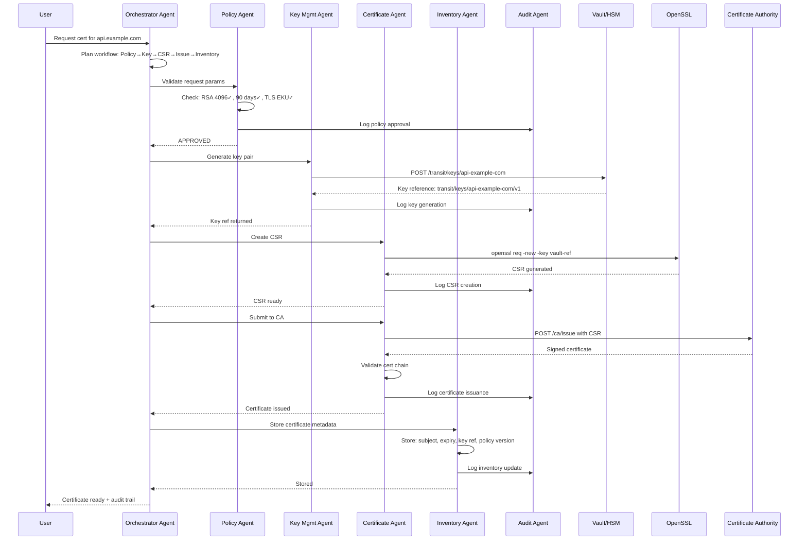
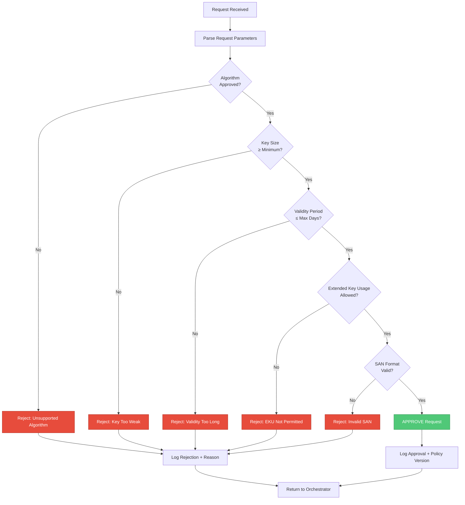
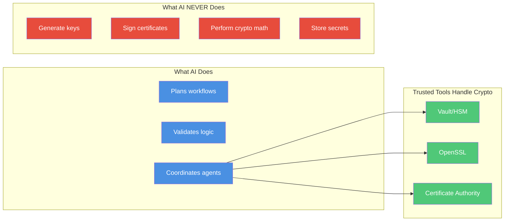
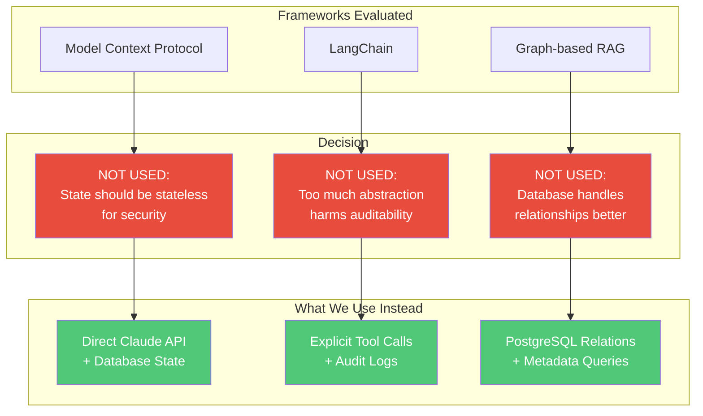

# AI-Driven PKI Lifecycle Management Architecture

## 1. Architecture Overview

This system uses a **multi-agent architecture** where a central Orchestrator Agent coordinates five specialized agents to handle PKI operations. The key idea is simple: AI agents plan and validate workflows, but they never touch actual cryptography—that's handled by proven tools like OpenSSL, Vault, and CA systems.

Every request goes through policy checks before execution, and everything gets logged for audits. Think of it as an intelligent control plane sitting on top of existing crypto infrastructure.

### High-Level Architecture

**Core Principle**: AI plans and validates. Trusted tools execute. Policy gates everything.

---

## 2. Agent Roles

**Orchestrator Agent (Central Claude)**
- Plans and sequences PKI workflows based on requests
- Delegates tasks to specialized agents
- Handles dependencies (e.g., need a key before making a CSR)
- Coordinates multi-step operations
- Never makes policy decisions or runs crypto operations directly

**Policy Agent**
- Validates every request against security rules
- Checks key sizes, algorithms, validity periods, usage constraints
- Rejects non-compliant operations before they execute
- Maintains policy versions for compliance tracking
- Example rules: "RSA keys must be ≥3072 bits", "Cert validity ≤397 days"

**Key Management Agent**
- Calls Vault/HSM APIs to generate key pairs
- Manages key rotation and lifecycle
- Only handles key references, never raw key material
- Tracks which keys are used for which certificates

**Certificate Agent**
- Creates CSRs using OpenSSL with validated parameters
- Submits requests to CA systems (internal CA, ACME, etc.)
- Handles certificate renewal and revocation
- Validates certificate chains before deployment

**Inventory Agent**
- Tracks all cryptographic assets (keys, certs, CSRs)
- Monitors expiration dates
- Triggers proactive renewals (usually 30 days before expiry)
- Generates reports on certificate inventory

**Audit Agent**
- Logs every operation with timestamps and results
- Records policy decisions (approved/rejected and why)
- Maintains tamper-proof audit trail
- Supports compliance reporting (SOC2, PCI-DSS, etc.)

---

## 3. End-to-End Orchestration Flow

### Example Workflow: Certificate Issuance

Request: *"Issue TLS certificate for api.example.com with RSA 4096, 90-day validity"*

### Step-by-Step Breakdown

1. **Request Received**
   - User submits: "Issue cert for api.example.com, RSA 4096, 90 days"
   - Orchestrator receives and parses the request

2. **Workflow Planning**
   - Orchestrator creates plan: Check Policy → Generate Key → Create CSR → Submit to CA → Update Inventory
   - Identifies dependencies between steps

3. **Policy Validation**
   - Orchestrator asks Policy Agent to validate
   - Policy Agent checks:
     - RSA 4096 meets minimum requirement (3072 bits) ✓
     - 90-day validity within max limit (397 days) ✓
     - TLS server auth EKU is allowed ✓
   - **Result**: APPROVED
   - Audit Agent logs: `[Policy Check] PASSED, req-1234, policy-v2.3`

4. **Key Generation**
   - Orchestrator delegates to Key Management Agent
   - Key Mgmt calls Vault: `POST /transit/keys/api-example-com type=rsa-4096`
   - Vault returns key reference (not the actual key)
   - Audit logs: `[Key Generated] RSA-4096, ref: transit/keys/api-example-com`

5. **CSR Creation**
   - Orchestrator delegates to Certificate Agent
   - Cert Agent builds OpenSSL config with validated params
   - Calls: `openssl req -new -key <vault-ref> -config csr.conf`
   - CSR created and validated
   - Audit logs: `[CSR Created] CN=api.example.com`

6. **Certificate Issuance**
   - Cert Agent submits CSR to internal CA via REST API
   - CA validates and signs certificate
   - Cert Agent validates the certificate chain
   - Audit logs: `[Cert Issued] Serial: 4A:3F..., Expiry: 2025-04-18`

7. **Inventory Update**
   - Orchestrator delegates to Inventory Agent
   - Inventory stores metadata: subject, SANs, expiry, key reference, policy version
   - Sets up expiry monitoring (will alert 30 days before expiry)
   - Audit logs: `[Inventory Updated] cert-5678, monitoring enabled`

8. **Response to User**
   - Orchestrator aggregates all results
   - Returns certificate, expiry date, serial number, audit reference
   - User deploys certificate to production

### Policy Agent Decision Flow

---

## 4. Why This Architecture Is Better

### Compared to Monolithic Single-Agent Design

**Problem**: One big Claude instance trying to do everything becomes a mess. Policy logic gets buried in prompts, state management breaks down, and you can't audit which rules were actually applied.

**Our Solution**:
- **Clear responsibilities**: Each agent has one job. Policy Agent only does policy. Certificate Agent only handles certs.
- **Testable components**: You can test policy enforcement independently from cert issuance
- **Better failure handling**: If the CA is down, only Certificate Agent fails—Orchestrator can retry or alert ops
- **Auditable decisions**: Policy checks are explicit function calls with logged results, not buried in LLM reasoning

### Compared to Traditional Workflow Engines (Airflow, Temporal)

**Problem**: Hardcoded workflows need code changes for every new scenario. Want to issue 50 certs with incremental SANs? Write a new DAG.

**Our Solution**:
- **Adaptive planning**: Orchestrator can compose agents in new ways without code changes
- **Natural language interface**: Operators can say "renew all certs expiring in 14 days" instead of writing YAML
- **Context awareness**: Orchestrator remembers conversation context ("use the same key for renewal")

### Security Benefits

- **No crypto in AI**: Agents never touch private keys or perform cryptographic operations
- **Policy as guardrails**: Rules are enforced programmatically before execution
- **Immutable audit trail**: Every action is logged with cryptographic integrity
- **Separation of duties**: Different agents can require different authentication levels

### Scalability and Extensibility

**Easy to extend**: Need post-quantum crypto support? Add a new "PQ Migration Agent" and register it with the Orchestrator. No changes to existing agents.

**Multi-tenancy ready**: Different organizations can have isolated Policy Agents with custom rules while sharing infrastructure.

---

## 5. Final Design Decision Summary

### Architecture Decision Summary Table

### Technology Stack (What We Actually Use)

**Agent Layer**:
- Claude API (Sonnet 4) for Orchestrator
- Specialized Claude instances for sub-agents (could be same model, different system prompts)

**Cryptographic Tools**:
- HashiCorp Vault Transit Engine or AWS KMS for key management
- OpenSSL for CSR generation and cert validation
- Internal CA (e.g., EJBCA, Smallstep) or ACME for issuance

**Data Layer**:
- PostgreSQL for inventory (encrypted columns for sensitive metadata)
- AWS CloudWatch Logs or Splunk for immutable audit trail

**Policy Enforcement**:
- JSON/YAML policy files versioned in Git
- Policy Agent evaluates rules programmatically (not with LLM reasoning)

**Why This Stack**:
- **Battle-tested tools**: OpenSSL and Vault are industry standard—no reinventing crypto
- **Clear audit trail**: Logs go to dedicated SIEM, not mixed with app logs
- **Simple to reason about**: No complex framework magic—just API calls and database queries
- **Enterprise-ready**: Supports multi-tenancy, RBAC, compliance reporting out of the box

---

## Final Thought

This architecture isn't about using the fanciest AI tech. It's about using AI where it's actually helpful (planning, coordination, natural language interfaces) and keeping it away from where it's risky (crypto operations, policy decisions, state management).

The multi-agent design gives us clean separation of concerns, making the system easier to audit, test, and extend. And by avoiding heavyweight frameworks, we keep things simple enough that a### MCP (Model Context Protocol): NOT USED

**Why we considered it**: MCP helps persist tool schemas and conversation state across sessions. Could be useful for remembering certificate preferences or past requests.

**Why we didn't use it**:
- **Crypto operations should be stateless**: Each request must be validated against current policy, not influenced by stale context
- **We already have persistent state**: Inventory Agent and Audit Agent use proper databases with access controls
- **Determinism matters more than memory**: For security-critical systems, we want explicit policy checks every time, not inferred context
- **Audit trail is source of truth**: Historical decisions are in immutable logs, not in LLM context

**Example of why this matters**: If a cert was issued 6 months ago with RSA 2048 (which was compliant then), but policy now requires 3072 bits, MCP context might suggest "do it like last time"—which would violate current policy. Our stateless approach forces fresh validation every time.

### LangChain: NOT USED

**Why we considered it**: LangChain provides agent frameworks, memory management, and tool chaining—sounds perfect for orchestration.

**Why we didn't use it**:
- **Too much abstraction**: LangChain adds layers between Claude and tools, making it harder to audit exactly what happened
- **State management complexity**: LangChain's memory systems introduce non-determinism—bad for security-critical workflows
- **Vendor lock-in**: Tight security team can actually review and trust the system.

That's what makes this enterprise-grade: not complexity, but thoughtful simplicity with the right guardrails in the right places.